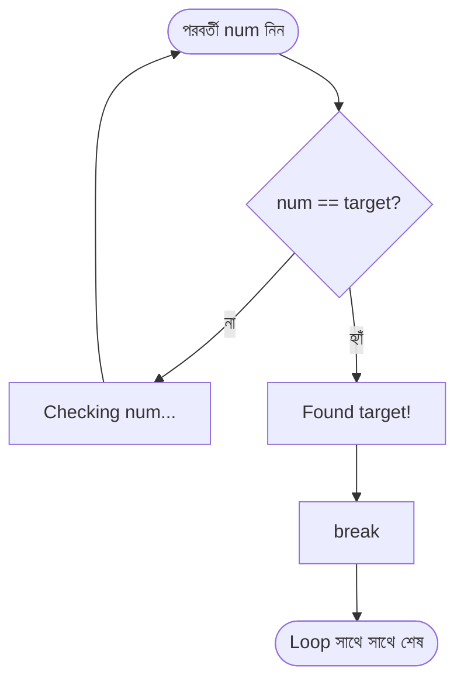
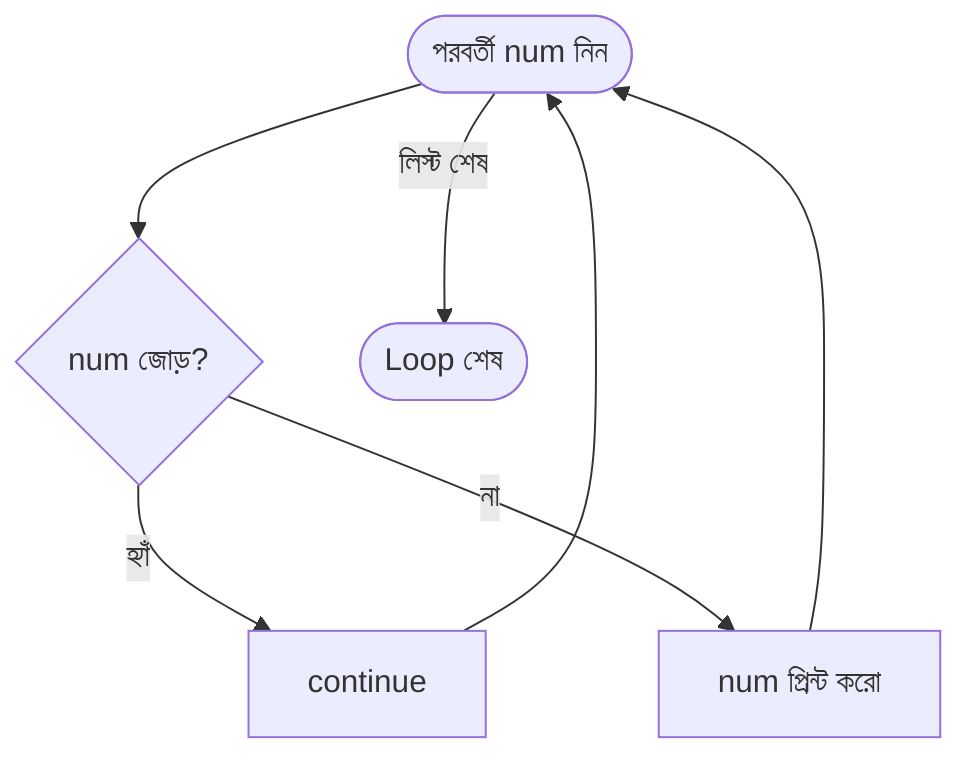

# Live Class 08: For Loop, range() & Loop Nesting

> **Batch:** Mastering Python: From Zero to Hero (Batch 12)
> **Module:** Module 3 - Loops & Iteration (Live Class 2 of 3)
> **Duration:** ৯০ মিনিট (Live Session)
> **Prerequisite:** Live Class 07 (`while` loop-এর ৪টি প্রধান অংশ, counters, infinite loops - see `Ostad-Batch11-Live-Class-07-While-Loop-Counters/`)

---

## Learning Objectives

এই ক্লাস শেষে students পারবে:

- **`for` loop** ব্যবহার করে একটি list বা string-এর প্রতিটি item-এর উপর iterate করতে, এবং এটি কেন C/Java-র counter loop নয় তা ব্যাখ্যা করতে।
- **`range()` function** দিয়ে নির্দিষ্ট সংখ্যক বার loop চালাতে - `start`, `stop`, `step` ব্যবহার করে, এবং `stop`-এর **exclusive** আচরণ মনে রাখতে।
- **Nested loop** (loop-এর ভিতরে loop) লিখে multiplication table ও pattern তৈরি করতে।
- **`break`** দিয়ে কোনো loop থেকে সাথে সাথে বেরিয়ে আসতে, এবং **`continue`** দিয়ে শুধু বর্তমান iteration বাদ দিয়ে loop চালিয়ে যেতে - দুটোর পার্থক্য ব্যাখ্যা করতে।

---

## Introduction

গত ক্লাসে (Live Class 07) আমরা শিখেছি `while` loop - এর চারটি প্রধান অংশ (Initialization, Condition, Body, Update), counter, এবং infinite loop। আজ আমরা শিখব Python-এর দ্বিতীয়, এবং সবচেয়ে বেশি ব্যবহৃত loop - **`for` loop**। একটা গুরুত্বপূর্ণ কথা শুরুতেই বলে রাখি: **Python-এর `for` loop C বা Java-র মতো counter loop নয় - এটি একটি "for-each" loop**, যা একটি iterable (list, string, ইত্যাদি)-এর প্রতিটি item-এর উপর দিয়ে একে একে হেঁটে যায়।

এর পাশাপাশি আজ আমরা শিখব **`range()`** function - যা দিয়ে "n বার কিছু করো" ধরনের কাজ সহজে লেখা যায়, এবং **nested loop** - অর্থাৎ একটি loop-এর ভিতরে আরেকটি loop, যা দিয়ে multiplication table বা pattern তৈরি হয়। সবশেষে শিখব দুটি **loop control statement** - **`break`** (loop থেকে সাথে সাথে বেরিয়ে আসা) এবং **`continue`** (শুধু বর্তমান iteration বাদ দিয়ে পরের iteration-এ চলে যাওয়া) - পরের ক্লাসের mini project (Number Guessing Game)-এ এই দুটোই সরাসরি লাগবে।

---

## Why This Topic Matters

- **`for` loop প্রতিদিনের কাজ:** একটি list-এর প্রতিটি product, একটি ফাইলের প্রতিটি লাইন, একটি database-এর প্রতিটি row - সবকিছু process করতে `for` loop লাগে।
- **`range()` হলো "n বার করো" লেখার সবচেয়ে সহজ ও Pythonic উপায়** - manual counter বানানোর চেয়ে অনেক পরিষ্কার ও কম bug-প্রবণ।
- **Nested loop গ্রিড/টেবিল/প্যাটার্নের ভিত্তি:** নামতা, স্প্রেডশিট-এর row-column, বা একটি দাবার বোর্ড - সবকিছুই দুটি loop-এর সমন্বয়ে তৈরি হয়।
- **`break`/`continue` ছাড়া অনেক বাস্তব logic লেখাই যায় না:** কোনো কিছু খুঁজে পেলেই থেমে যাওয়া (search), বা অপ্রয়োজনীয় item বাদ দিয়ে বাকিগুলো process করা (filtering) - এই দুই খুবই কমন প্যাটার্নের জন্য `break` ও `continue` অপরিহার্য।

---

## Core Concepts

---

### Concept 1: The `for` Loop (for-each over iterables)

#### Definition

**Python-এর `for` loop একটি iterable-এর প্রতিটি item-এর উপর দিয়ে একে একে iterate করে এবং প্রতিটি item-এর জন্য body একবার চালায়।** এটি একটি **for-each** loop, C/Java-র মতো counter-driven loop নয়।

#### Explanation

যেকোনো **iterable** - list, string, tuple - এর উপর `for` চলতে পারে। প্রতিটি iteration-এ Python পরের item-টি বের করে এনে loop variable-এ রাখে। index দরকার হলে manual counter না বানিয়ে **`enumerate()`** ব্যবহার করা professional উপায় (default index `0` থেকে শুরু হয়; `start=1` দিলে `1` থেকে শুরু হয়)।

#### Real World Example

একটি **delivery rider**-এর কথা ভাবুন, যার কাছে আজকের delivery list আছে: Dhaka, Chattogram, Khulna, Sylhet। সে list-এর প্রথম থেকে শেষ পর্যন্ত একে একে প্রতিটি শহরে যায়। সে আগে গোনে না "মোট কতগুলো" - সে শুধু "প্রতিটি শহরের জন্য" কাজ করে। এটিই for-each।

#### Code Example 1a - list-এর উপর for-each

**কেন এই কোড লিখছি:** ধরুন ঈদের আগে একটা bazar list হাতে নিয়ে দোকানে ঢুকলেন - mango, jackfruit, litchi। আপনি "মোট কয়টা জিনিস আছে" সেটা আগে না গুনে সরাসরি লিস্টের প্রথম জিনিস থেকে শুরু করে একে একে প্রতিটা জিনিস কেনেন, লিস্ট শেষ হলেই কেনাকাটা শেষ। এটাই নিচের `for fruit in fruits` লাইনটা করছে - `fruits` লিস্টের প্রতিটা item-এর জন্য একবার কাজ (এখানে `print`) করছে, কোনো ম্যানুয়াল counter (`i = 0`, `i += 1`) ছাড়াই।

> এই কোড `examples/example_01_for_loop_over_list.py` ফাইল থেকে নেওয়া।

```python
fruits = ["mango", "jackfruit", "litchi"]
for fruit in fruits:
    print(f"Fruit: {fruit}")
```

##### Output

```text
Fruit: mango
Fruit: jackfruit
Fruit: litchi
```

#### Code Example 1b - string-এর উপর for-each

**কেন এই কোড লিখছি:** একজন শিক্ষক ছাত্রকে "PYTHON" শব্দটা বানান করে বলতে বলছেন - একটা করে অক্ষর ধরে ধরে বলা, পুরো শব্দটা এক নিঃশ্বাসে না বলে। একটা string-ও আসলে অক্ষরের একটা iterable - তাই `for letter in word` ঠিক এই "একটা করে অক্ষর ধরে ধরে" কাজটাই করে।

> এই কোড `examples/example_02_for_loop_over_string.py` ফাইল থেকে নেওয়া।

```python
word = "Python"
for letter in word:
    print(letter, end=" ")
print()
```

##### Output

```text
P y t h o n
```

#### Code Example 1c - enumerate() দিয়ে সিরিয়াল নম্বর

**কেন এই কোড লিখছি:** একটা রসিদ বা exam-এর roll list-এ প্রতিটা আইটেমের পাশে সিরিয়াল নম্বর (১, ২, ৩...) থাকে। এই সিরিয়াল নম্বরটা নিজে হাতে গুনে (`i = 0`, প্রতিবার `i += 1`) রাখা যায়, কিন্তু Python-এ এটা `enumerate()`-কে দিয়ে দিলে ভুল হওয়ার সুযোগ কমে যায় - `enumerate(fruits, start=1)` নিজে থেকেই index আর value একসাথে দেয়।

> এই কোড `examples/example_03_for_loop_enumerate.py` ফাইল থেকে নেওয়া।

```python
fruits = ["mango", "jackfruit", "litchi"]
for index, fruit in enumerate(fruits, start=1):
    print(f"{index}. {fruit}")
```

##### Output

```text
1. mango
2. jackfruit
3. litchi
```

#### Common Mistakes

- Manual counter বানানো (`i = 0` ... `i += 1`) যেখানে `enumerate()` অনেক পরিষ্কার সমাধান দেয়।
- `for` loop-কে C/Java-র মতো "শুরু-শেষ-step" counter loop ভাবা - Python-এ `for` সরাসরি item দেয়, index নয়।
- অর্থহীন loop variable নাম ব্যবহার করা (`for x in y`) - `for fruit in fruits` এর মতো অর্থবহ নাম পড়া সহজ করে।

#### Best Practices

- index দরকার না হলে শুধু item iterate করুন; দরকার হলে `enumerate()`।
- প্রতিটি loop variable-কে সেই collection-এর একটি একক item বোঝায় এমন নাম দিন (`for fruit in fruits`, `for letter in word`)।

---

### Concept 2: The `range()` Function

#### Definition

**`range()` একটি built-in function যা সংখ্যার একটি lazy ক্রম (sequence) তৈরি করে**, সাধারণত `for` loop-এ নির্দিষ্ট সংখ্যক বার iterate করার জন্য ব্যবহৃত হয়।

#### Explanation

`range()`-এর তিনটি রূপ:

| ব্যবহার                    | উৎপন্ন করে                                     |
| -------------------------- | ---------------------------------------------- |
| `range(stop)`              | `0, 1, ..., stop-1`                            |
| `range(start, stop)`       | `start, start+1, ..., stop-1`                  |
| `range(start, stop, step)` | `start, start+step, ...` (`stop`-এর আগেই থামে) |

গুরুত্বপূর্ণ দুটি তথ্য:

- **`stop` exclusive** - `stop` মান কখনো অন্তর্ভুক্ত হয় না। এটিই classic **off-by-one** trap - `range(1, 5)` দেয় `1, 2, 3, 4`, পাঁচ পর্যন্ত পেতে `range(1, 6)` লাগবে।
- **`step` negative হতে পারে** - তখন গণনা নিচের দিকে নামে।

#### Real World Example

একটি লিফটের তলা নির্বাচন ভাবুন: `range(1, 11)` মানে ১ থেকে ১০ তলা (১১ বাদ)। আবার `range(10, 0, -2)` মানে ১০ম তলা থেকে দুই ধাপে নিচে নামা - ১০, ৮, ৬, ৪, ২।

#### Code Example 2a - range(stop)

**কেন এই কোড লিখছি:** একজন কোচ warm-up-এ ৫টা push-up গোনেন - প্রথমটাকে ধরা হয় `0` নম্বর push-up হিসেবে (মোট ৫টা: ০, ১, ২, ৩, ৪)। শুধু "কতবার" চাই সেটা বললেই হয় - কোথা থেকে শুরু করব সেটা আলাদা করে বলা লাগে না, `range(5)` নিজে থেকেই `0` থেকে শুরু করে।

> এই কোড `examples/example_04_range_stop_only.py` ফাইল থেকে নেওয়া।

```python
for i in range(5):
    print(i, end=" ")
print()
```

##### Output

```text
0 1 2 3 4
```

#### Code Example 2b - range(start, stop)

**কেন এই কোড লিখছি:** এবার কোচ গ্রেডেড সেট শুরু করান ঠিক ২ নম্বর সেট থেকে ৬ নম্বর সেট পর্যন্ত (১ নম্বর সেটটা warm-up ছিল, বাদ)। এখানে শুধু "কতবার" না, "কোথা থেকে শুরু" সেটাও বলা দরকার - তাই `range(2, 7)`, যেখানে `7` নিজে বাদ পড়ে যায় (exclusive), তাই শেষ হয় `6`-এ।

> এই কোড `examples/example_05_range_start_stop.py` ফাইল থেকে নেওয়া।

```python
for i in range(2, 7):
    print(i, end=" ")
print()
```

##### Output

```text
2 3 4 5 6
```

#### Code Example 2c - range(start, stop, step)

**কেন এই কোড লিখছি:** স্কুলে বাচ্চাদের skip-counting শেখানো হয় - "০, ২, ৪, ৬..." করে জোড় সংখ্যা গোনা, প্রতিবার এক না বেড়ে দুই করে বাড়ে। এই "প্রতিবার কত করে বাড়বে" জিনিসটাই `step` - `range(0, 11, 2)` মানে `0` থেকে শুরু করে `11`-এর আগে পর্যন্ত, প্রতিবার `2` করে বেড়ে।

> এই কোড `examples/example_06_range_step.py` ফাইল থেকে নেওয়া।

```python
for i in range(0, 11, 2):
    print(i, end=" ")
print()
```

##### Output

```text
0 2 4 6 8 10
```

#### Code Example 2d - negative step (নিচের দিকে গোনা)

**কেন এই কোড লিখছি:** রকেট উৎক্ষেপণের কাউন্টডাউন সবসময় নিচের দিকে নামে - এখানে একটু ভিন্ন ভার্সন, প্রতিবার দুই ধাপ করে নামা: ১০, ৮, ৬, ৪, ২। এটা করতে হলে `step`-কে ঋণাত্মক (`-2`) দিতে হয়, নাহলে Python বুঝবে না দিক কোনদিকে।

> এই কোড `examples/example_07_range_negative_step.py` ফাইল থেকে নেওয়া।

```python
for i in range(10, 0, -2):
    print(i, end=" ")
print()
```

##### Output

```text
10 8 6 4 2
```

#### Common Mistakes

- `range(1, 10)` লিখে ১০ পর্যন্ত পাওয়ার আশা করা - আসলে ৯ পর্যন্ত। ১০ চাইলে `range(1, 11)`।
- `range(10, 0)` লিখে নিচে নামার আশা করা - step ছাড়া এটি খালি sequence দেয় (কারণ start > stop, default step `+1`)। নিচে নামতে `range(10, 0, -1)` লাগবে।

#### Best Practices

- "n বার কিছু করো" দরকার হলে `for _ in range(n):` ব্যবহার করুন (`_` মানে variable-টি ব্যবহার হবে না)।
- off-by-one এড়াতে সবসময় মনে রাখুন: **stop exclusive**।

---

### Concept 3: Nested Loops

#### Definition

**Nested loop হলো একটি loop যা আরেকটি loop-এর body-র ভিতরে থাকে।** বাইরের (outer) loop-এর প্রতিটি একক iteration-এর জন্য ভিতরের (inner) loop সম্পূর্ণভাবে একবার চলে।

#### Explanation

মোট iteration সংখ্যা = (outer count) × (inner count)। দুটি loop যদি প্রতিটি `n` বার চলে, মোট কাজ হয় `n × n`। সাধারণ ব্যবহার: multiplication table, grid, এবং pattern printing (star triangle)।

#### Real World Example

একটি **স্কুলের ঘড়ি** ভাবুন: ঘণ্টার কাঁটা (outer) একবার নড়লে মিনিটের কাঁটা (inner) পুরো ৬০ বার ঘোরে। অথবা একটি নামতার বই: প্রতিটি সংখ্যার (row) জন্য ১ থেকে ১০ পর্যন্ত (column) গুণ করা - এটিই nested loop।

#### Code Example 3a - multiplication table (নামতা)

**কেন এই কোড লিখছি:** স্কুলের নামতার বইটার কথা চিন্তা করুন - "১-এর ঘর" পুরোটা শেষ না করে "২-এর ঘরে" যাওয়া যায় না; প্রতিটা row (row = ১, ২, ৩...) শেষ করার আগে তার ভিতরের সবগুলো column (১×row, ২×row... ৫×row) হিসাব করতে হয়। এই "একটা বড় ধাপের ভিতরে অনেকগুলো ছোট ধাপ" জিনিসটাই nested loop - বাইরের `for row in range(1, 6)` প্রতিটা সারি বেছে নেয়, আর ভিতরের `for col in range(1, 6)` সেই সারির সবগুলো ঘর পূরণ করে।

> এই কোড `examples/example_08_nested_loop_multiplication_table.py` ফাইল থেকে নেওয়া।

```python
for row in range(1, 6):              # outer: chooses the row
    for col in range(1, 6):          # inner: fills the columns of that row
        product = row * col
        print(f"{product:4}", end="")
    print()                          # end the row -> move to the next line
```

##### Output

```text
   1   2   3   4   5
   2   4   6   8  10
   3   6   9  12  15
   4   8  12  16  20
   5  10  15  20  25
```

#### Code Example 3b - star triangle pattern

**কেন এই কোড লিখছি:** একটা সিঁড়ি বানাচ্ছেন কল্পনা করুন - প্রথম ধাপ ১ ইঞ্চি, দ্বিতীয় ধাপ ২ ইঞ্চি, এভাবে প্রতিটা ধাপ আগেরটার চেয়ে বড়। এখানে row নম্বরটাই ঠিক করে দিচ্ছে সেই row-এ কয়টা `*` বসবে (`row = 3` মানে `***`) - এটা আগের নামতার কোডের মতো পুরোদস্তুর nested loop না হলেও, "row-এর মান দিয়ে ভিতরের কাজের পরিমাণ ঠিক হচ্ছে" এই একই আইডিয়াটা দেখায়, যেটা পরের ক্লাসে pattern printing-এর ভিত্তি হবে।

> এই কোড `examples/example_09_nested_loop_star_triangle.py` ফাইল থেকে নেওয়া।

```python
for row in range(1, 6):
    print("*" * row)
```

##### Output

```text
*
**
***
****
*****
```

#### Common Mistakes

- Inner loop শেষে `print()` (newline) দিতে ভুলে যাওয়া - সব output এক লাইনে মিশে যায়।
- Outer ও inner loop-এ একই variable নাম ব্যবহার করা - পরস্পরকে overwrite করে।
- অপ্রয়োজনে nested loop ব্যবহার করা - অনেক সময় একটি loop দিয়েই কাজ হয়ে যায়, যা দ্রুততর।

#### Best Practices

- outer/inner-এর জন্য আলাদা, অর্থপূর্ণ নাম দিন (`row`/`col`)।
- nested loop লেখার আগে ভাবুন এটি ঠিক কতবার চলবে (outer × inner)।

---

### Concept 4: The `break` Statement

#### Definition

**`break` একটি loop control statement যা সবচেয়ে কাছের (nearest) enclosing loop থেকে সাথে সাথে বেরিয়ে আসে**, বাকি সব iteration বাদ দিয়ে - loop-এর ঠিক পরের কোডে চলে যায়।

#### Explanation

যা খুঁজছিলেন তা পেয়ে গেলে বাকি item গুলো আর চেক করার দরকার নেই - `break` ঠিক সেই মুহূর্তে loop থামিয়ে দেয়। `for` ও `while` - দুই ধরনের loop-এই কাজ করে। **সবচেয়ে গুরুত্বপূর্ণ সতর্কতা:** nested loop-এ `break` শুধু **সবচেয়ে কাছের (ভিতরের) loop** থেকে বেরোয় - বাইরের loop থামে না, চলতেই থাকে।

#### Real World Example

একটি **বইয়ের তাকে বই খোঁজা** ভাবুন - নির্দিষ্ট বইটা পেয়ে গেলে তাকের বাকি বইগুলো আর চেক করেন না, সাথে সাথে থেমে যান। কিন্তু যদি একই তাকে একাধিক শেলফ (আলমারির একাধিক তাক) থাকে, একটা তাকে বই পেয়ে থামলেও পুরো আলমারি খোঁজা থামে না - শুধু সেই তাকটার খোঁজা থামে। এটাই "nested loop-এ break শুধু ভিতরের loop থামায়"।

#### Code Example 4a - খুঁজে পেলেই থেমে যাওয়া

**কেন এই কোড লিখছি:** একটা লিস্টে নির্দিষ্ট সংখ্যা (`target`) খুঁজছি। পেয়ে গেলে বাকি সব সংখ্যা চেক করার কোনো মানে নেই - বাস্তব জীবনে যেমন হারানো চাবি খুঁজে পেলে বাকি ড্রয়ার আর হাতড়ানো লাগে না।

> এই কোড `examples/example_10_break_basic.py` ফাইল থেকে নেওয়া।

```python
numbers = [4, 9, 15, 22, 30, 7]
target = 22

for num in numbers:
    if num == target:
        print(f"Found {target}!")
        break
    print(f"Checking {num}...")
```

##### Output

```text
Checking 4...
Checking 9...
Checking 15...
Found 22!
```

##### Flow Chart



#### Code Example 4b - nested loop-এ break শুধু ভিতরের loop থামায়

**কেন এই কোড লিখছি:** এটা Live Class 09-এর mini project-এ সবচেয়ে কমন যে ভুলটা হয় সেটাই আগে থেকে দেখিয়ে রাখছি - অনেকে ভাবেন `break` দিলে সব loop থেমে যাবে। নিচের কোডে outer loop-এর প্রতিটা row-তেই inner loop `col == 3`-এ `break` করছে, কিন্তু outer loop থেমে না গিয়ে ঠিক পরের row-এ চলে যাচ্ছে - `break` শুধু তার সবচেয়ে কাছের (inner) loop-টাকেই থামায়।

> এই কোড `examples/example_11_break_nested_only_exits_inner.py` ফাইল থেকে নেওয়া।

```python
for row in range(1, 4):
    print(f"Row {row}:")
    for col in range(1, 6):
        if col == 3:
            break
        print(f"  col {col}")

print("Outer loop finished all 3 rows - break only stopped the inner loop each time.")
```

##### Output

```text
Row 1:
  col 1
  col 2
Row 2:
  col 1
  col 2
Row 3:
  col 1
  col 2
Outer loop finished all 3 rows - break only stopped the inner loop each time.
```

#### Common Mistakes

- `break` সব nested loop থামিয়ে দেয় ভাবা - আসলে শুধু সবচেয়ে কাছের loop থামে (Code Example 4b দেখুন)।
- `if` condition ছাড়াই `break` লিখে ফেলা - তাহলে loop প্রথম iteration-এই থেমে যাবে, যা প্রায় সবসময় অনিচ্ছাকৃত।
- `break`-কে `return`-এর মতো ভাবা - `break` শুধু loop থামায়, function থেকে বেরোয় না।

#### Best Practices

- `break` ব্যবহার করুন শুধু তখনই যখন "খুঁজে পাওয়া গেছে" বা "আর দরকার নেই" - এমন স্পষ্ট একটা condition আছে।
- nested loop-এ শুধু ভিতরের loop থামাতে চাইলে `break` ঠিক আছে; দুটোই থামাতে চাইলে একটা flag variable ব্যবহার করুন বা বাইরের loop-এর condition-এ সেই flag চেক করুন।

---

### Concept 5: The `continue` Statement

#### Definition

**`continue` বর্তমান iteration-এর বাকি body বাদ দিয়ে সাথে সাথে পরের iteration-এ চলে যায়** - `break`-এর মতো পুরো loop থামায় না, শুধু এই একটা iteration-ই বাদ যায়।

#### Explanation

কোনো নির্দিষ্ট item বাদ দিয়ে বাকিগুলোর জন্য কাজ চালিয়ে যেতে হলে `continue` ব্যবহার হয়। এটি deep nested `if`/`else` এড়িয়ে কোড সোজা (flat) রাখতে সাহায্য করে। **সতর্কতা (`while` loop-এ):** Live Class 07-এর ৪টি অংশের মধ্যে Update স্টেপ যদি `continue`-এর **পরে** লেখা হয়, সেটা কখনো চলবে না - condition কখনো `False` হবে না, infinite loop হয়ে যাবে। তাই `while` loop-এ Update সবসময় `continue`-এর **আগে** বসাতে হবে।

#### Real World Example

একটি **ফলের কোয়ালিটি-চেক লাইনের** কথা ভাবুন - কর্মী প্রতিটা ফল হাতে নিয়ে দেখেন, পচা ফল পেলে সেটা শুধু বাদ দিয়ে (skip করে) পরের ফল ধরেন, পুরো লাইন বন্ধ করে দেন না (সেটা হতো `break`)। এটাই `continue` - "এইটা বাদ, পরেরটা দেখাও"।

#### Code Example 5a - নির্দিষ্ট item বাদ দিয়ে বাকিগুলো process করা

**কেন এই কোড লিখছি:** ১ থেকে ১০ পর্যন্ত সংখ্যার মধ্যে শুধু বিজোড় সংখ্যাগুলো দেখাতে চাই। প্রতিটা জোড় সংখ্যার জন্য `if`-এর ভিতরে বাকি কোড `else`-এ মুড়ে না রেখে, জোড় হলে `continue` দিয়ে সেটা বাদ দিয়ে এগিয়ে যাওয়াই সহজ ও পরিষ্কার।

> এই কোড `examples/example_12_continue_basic.py` ফাইল থেকে নেওয়া।

```python
numbers = list(range(1, 11))

for num in numbers:
    if num % 2 == 0:
        continue
    print(num, end=" ")
print()
```

##### Output

```text
1 3 5 7 9
```

##### Flow Chart



#### Code Example 5b - `while` loop-এ `continue`-এর Update-trap এড়ানো

**কেন এই কোড লিখছি:** Live Class 07-এ শেখা `while` loop-এর ৪টি অংশের মধ্যে Update স্টেপ ভুলে গেলে infinite loop হয় - `continue`-এর সাথে এই ভুলটা আরও সহজে হয়ে যায়, কারণ Update যদি `continue`-এর পরে লেখা থাকে, সেই লাইনে Python কখনোই পৌঁছায় না। নিচের কোডে তাই `count += 1` (Update) ইচ্ছাকৃতভাবে `continue`-চেক করার **আগেই** বসানো হয়েছে।

> এই কোড `examples/example_13_continue_in_while_caution.py` ফাইল থেকে নেওয়া।

```python
count = 0
while count < 10:
    count += 1            # Update - continue-এর আগে, তাই সবসময় চলে
    if count % 2 == 0:
        continue
    print(count, end=" ")
print()
```

##### Output

```text
1 3 5 7 9
```

#### Common Mistakes

- `continue`-কে `break`-এর মতো ভাবা - `continue` loop থামায় না, শুধু এই iteration বাদ দেয়।
- `while` loop-এ Update স্টেপ `continue`-এর **পরে** লেখা - তাহলে যে iteration-এ `continue` চলে, সেবার Update হয় না, ধীরে ধীরে বা সবসময় condition `True` থেকে যেতে পারে (infinite loop)।
- অতিরিক্ত `continue` ব্যবহার করে কোড এলোমেলো করে ফেলা - একটা সহজ `if`/`else` যথেষ্ট হলে সেটাই ব্যবহার করা ভালো।

#### Best Practices

- `for` loop-এ `continue` নিরাপদ - পরের item নিজে থেকেই আসে। `while` loop-এ ব্যবহারের আগে নিশ্চিত করুন Update স্টেপ `continue`-চেকের **আগে** বসানো আছে।
- `continue` দিয়ে "এই case-টা বাদ" বোঝানো কোডকে nested `if`-এর চেয়ে বেশি পড়ার উপযোগী করে তোলে - কিন্তু একটা loop-এ একাধিক `continue` থাকলে flow বোঝা কঠিন হতে পারে, তখন ভেবে দেখুন সহজ করা যায় কিনা।

---

## Real World Bangladeshi Example

- **মুদি দোকানের বিল:** ঝুড়ির প্রতিটি product `for` loop দিয়ে iterate করে দাম × পরিমাণ যোগ করে মোট বিল বের করা।
- **Result Sheet:** একটি ক্লাসের প্রতিটি ছাত্রের (outer loop) প্রতিটি বিষয়ের (inner loop) নম্বর যোগ করে total ও GPA বের করা - এটিই nested loop-এর বাস্তব ব্যবহার।
- **`break` - বাস স্ট্যান্ডে যাত্রী খোঁজা:** কন্ডাক্টর নির্দিষ্ট নামের যাত্রী ডাকতে ডাকতে খুঁজছেন, সেই যাত্রী সাড়া দিলেই ডাকা বন্ধ করে দেন - বাকি যাত্রীদের নাম আর ডাকার দরকার নেই।
- **`continue` - QC লাইনে পচা ফল বাদ দেওয়া:** ফল বাছাইয়ের সময় পচা ফল পেলেই সেটা বাদ দিয়ে পরের ফল দেখা হয়, পুরো বাছাই লাইন বন্ধ হয় না।

---

## Hands-On Examples

আজকের উদাহরণ ১৩টি ফাইল `examples/` folder-এ আছে - প্রতিটি ফাইলে একটামাত্র concept, নিজে টাইপ করে এবং ভিন্ন ভিন্ন মান দিয়ে পরিবর্তন করে run করুন।

- **`example_01_for_loop_over_list.py`** - list-এর উপর `for` loop (for-each)।
- **`example_02_for_loop_over_string.py`** - string-এর উপর `for` loop।
- **`example_03_for_loop_enumerate.py`** - `enumerate()` দিয়ে index + value একসাথে।
- **`example_04_range_stop_only.py`** - `range(stop)`।
- **`example_05_range_start_stop.py`** - `range(start, stop)`।
- **`example_06_range_step.py`** - `range(start, stop, step)`।
- **`example_07_range_negative_step.py`** - negative step দিয়ে নিচে নামা।
- **`example_08_nested_loop_multiplication_table.py`** - nested loop দিয়ে multiplication table।
- **`example_09_nested_loop_star_triangle.py`** - nested loop দিয়ে star triangle pattern।
- **`example_10_break_basic.py`** - `break` দিয়ে খুঁজে পেলেই loop থামানো।
- **`example_11_break_nested_only_exits_inner.py`** - nested loop-এ `break` শুধু ভিতরের loop থামায়।
- **`example_12_continue_basic.py`** - `continue` দিয়ে নির্দিষ্ট item বাদ দিয়ে বাকিগুলো process করা।
- **`example_13_continue_in_while_caution.py`** - `while` loop-এ `continue` ব্যবহারের সময় Update স্টেপ কোথায় বসাতে হবে।

```bash
python examples/example_01_for_loop_over_list.py
python examples/example_02_for_loop_over_string.py
python examples/example_03_for_loop_enumerate.py
python examples/example_04_range_stop_only.py
python examples/example_05_range_start_stop.py
python examples/example_06_range_step.py
python examples/example_07_range_negative_step.py
python examples/example_08_nested_loop_multiplication_table.py
python examples/example_09_nested_loop_star_triangle.py
python examples/example_10_break_basic.py
python examples/example_11_break_nested_only_exits_inner.py
python examples/example_12_continue_basic.py
python examples/example_13_continue_in_while_caution.py
```

---

## Practice Tasks (Live Session)

1. **Even Numbers:** `for` loop ও `range()` দিয়ে ১ থেকে ৩০-এর মধ্যে সব জোড় সংখ্যা print করুন।
2. **String Reverse Print:** একটি string (যেমন `"Bangladesh"`)-এর প্রতিটি character উল্টো ক্রমে (শেষ থেকে শুরু) print করুন - `range()`-এ negative step ব্যবহার করুন।
3. **Nested Loop Grid:** `3x4` একটি grid print করুন, যেখানে প্রতিটি ঘরে `(row, col)` জোড়া দেখানো হবে - যেমন `(1,1) (1,2) (1,3) (1,4)`।
4. **First Multiple Finder (`break`):** ১ থেকে ১০০-এর মধ্যে ৭ দিয়ে নিঃশেষে বিভাজ্য প্রথম সংখ্যাটি খুঁজে বের করুন - পেয়ে গেলেই `break` করুন।
5. **Skip the Vowels (`continue`):** একটি string-এর প্রতিটি অক্ষর print করুন, কিন্তু vowel (a, e, i, o, u) পেলে `continue` দিয়ে সেটা বাদ দিন।

---

## Homework

1. `examples/` folder-এর প্রতিটি example নিজে হাতে টাইপ করে run করুন এবং output মিলিয়ে দেখুন।
2. `example_06_range_step.py`-তে ইচ্ছাকৃতভাবে `range(0, 11, 2)`-কে `range(0, 10, 2)`-এ বদলে run করুন এবং output-এর পার্থক্য নোট করুন (off-by-one বোঝার জন্য)।
3. `example_08_nested_loop_multiplication_table.py`-এর multiplication table-কে `10x10`-এ প্রসারিত করুন।
4. `example_11_break_nested_only_exits_inner.py`-তে `break`-এর জায়গায় একটা flag variable ব্যবহার করে **outer loop-টাকেও** থামিয়ে দেখুন - অর্থাৎ target পেলে পুরো nested loop-ই বন্ধ হয়ে যাবে।
5. `example_13_continue_in_while_caution.py`-তে ইচ্ছাকৃতভাবে `count += 1` লাইনটা `continue`-চেকের **পরে** নিয়ে গিয়ে (comment-এ দেখানো "WRONG order" অংশটা uncomment করে) দেখুন প্রোগ্রাম আটকে যায় কিনা - দেখলেই সাথে সাথে `Ctrl + C` চাপুন।

---

## Summary - Key Takeaways

- **`for` loop** Python-এ **for-each** - iterable-এর প্রতিটি item সরাসরি দেয়; index দরকার হলে `enumerate()`।
- **`range(start, stop, step)`** - `stop` সবসময় **exclusive** (off-by-one trap থেকে সাবধান), `step` negative হতে পারে (নিচে নামার জন্য)।
- **Nested loop** - loop-এর ভিতরে loop; মোট iteration = outer × inner; multiplication table ও pattern তৈরির মূল হাতিয়ার।
- **`break`** loop থেকে সাথে সাথে বেরিয়ে আসে (শুধু সবচেয়ে কাছের loop থেকে); **`continue`** শুধু বর্তমান iteration বাদ দিয়ে loop চালিয়ে যায় - `while` loop-এ Update স্টেপ সবসময় `continue`-চেকের আগে বসাতে হবে।
- Live Class 07 (`while`) ও Live Class 08 (`for`/`range`/nesting/`break`/`continue`) মিলিয়েই পরের ক্লাসের mini project - Number Guessing Game - তৈরি হবে।

---

## Next Class Preview - Live Class 09: Mini Project (Number Guessing Game)

পরের (এবং Module 3-এর শেষ) ক্লাসে আজ পর্যন্ত শেখা সবকিছু (`while` loop, counters, controlled infinite loop, `for` loop, `range()`, `break`, loop-`else`) একসাথে ব্যবহার করে একটি সম্পূর্ণ mini project বানানো হবে - **Number Guessing Game**।
